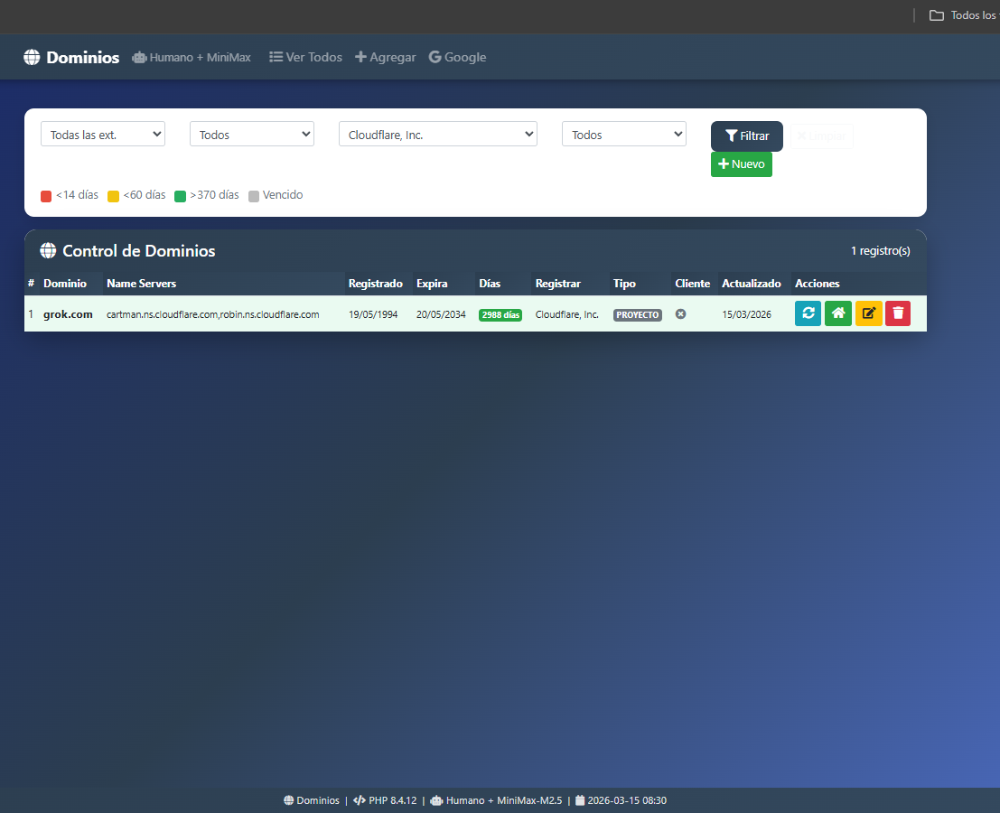

# 🌐 Control de Dominios — Pruébalo Ya #X

Experimento de **Vibe Coding** publicado el 18 de marzo de 2026 en
[vibecodingmexico.com/vibecoding-control-de-dominios/](https://vibecodingmexico.com/vibecoding-control-de-dominios/)

El reto: pedirle a 8 LLMs que generaran un sistema de control de
expiración de dominios en PHP 8.x con Bootstrap 4.6 y Font Awesome,
sobre una base de datos existente con 6 años en producción.

**Resultado: ninguno pasó a producción. El humano ganó.**

---

## 🏆 Resultado del Experimento

| Modelo | Resultado | Notas |
|---|---|---|
| **Grok** | 🥇 Primer lugar | Actualiza .com, falla en .com.mx |
| **Minimax** | 🥈 Segundo lugar | Único con altas/bajas. 917 líneas |
| **Claude** | 🥉 Tercer lugar | Error de GET en segundo dominio |
| Kimi 2.5 | No funciona | Código limpio que no actualiza. 619 líneas |
| Stepfun | Reprobado | Se ve bien, metería basura. 370 líneas |
| Cerebras | Reprobado | Mete basura. No se identifica |
| Deepseek | Reprobado | Botón de actualizar invisible |
| Gemini | Descalificado | Segunda versión ni carga |
| Copilot | Reprobado | 116 líneas, no carga de jsDelivr |

**Ganador real:** versión humana de 6 años + apariencia de Minimax,
integrados por Claude. Archivo: `dominiosminimaxhumano.php` pero en otro repositorio.

## 👤 humano.php — El Original (MIT, 2019)

Archivo base con 6 años en producción. No tiene altas ni bajas
porque nunca las necesitó — fue hecho para un propósito específico
y lo cumple. Ninguno de los 8 LLMs evaluados lo superó en
funcionalidad real con datos reales.

La función `obtenerInfoDominioMX` y el manejo de encoding
ISO-8859-1 son los dos detalles que ningún modelo consideró.

### dominiosminimaxhumano.php — El Ganador (LGPL 2.1)
Integración realizada por Claude Sonnet 4.6: lógica WHOIS del 
humano.php (6 años en producción) + apariencia y CRUD de Minimax.
Ajustes manuales: dos `global $link` y visibilidad de botones.
No es perfecto, pero es el único que funciona con datos reales.

---

## 📂 Archivos del Repositorio

- `dominiosminimaxhumano.php` — **El ganador funcional.** Híbrido
  humano + Minimax integrado por Claude. Licencia LGPL 2.1.
- `ver200.php` — Bonus: verifica estatus HTTP de dominios,
  detecta WordPress y versión. ~15 segundos para 78 dominios.  
- Archivos de los modelos participantes — para referencia y
  comparación directa.

---

## 🛠️ Especificaciones Técnicas

* **PHP:** 8.x procedural
* **Frontend:** Bootstrap 4.6.x vía jsDelivr + Font Awesome
* **Base de datos:** mysqli, conexión via `config.php` externo (`$link`)
* **Tabla:** `dominios2020` — estructura incluida en el post
* **Extensiones soportadas:** .com .net .org .info .monster .xyz
  .vip .mom — y en función separada: .mx y .com.mx
* **Colores de alerta:** rojo < 14 días, amarillo < 60 días,
  verde > 370 días

---

## ⚙️ Instalación Rápida

1. Crea tu `config.php` con la variable `$link` de conexión mysqli
2. Ejecuta el `CREATE TABLE` de `dominios2020` publicado en el post
3. Sube `dominiosminimaxhumano.php` a tu servidor
4. Ajusta los dos `global $link` si tu entorno lo requiere

5. ## 📸 Resultado Final

### Sistema Híbrido Humano + Minimax (dominiosminimaxhumano.php)

---

## 🧪 Notas del Autor

Tres décadas de experiencia dicen: nunca pruebes código de IA
directamente en producción. Este experimento se corrió sobre
una base de datos de prueba. Varios modelos habrían corrompido
datos reales sin advertencia.

Kimi y Minimax fueron los únicos que pensaron en altas y bajas.
Los demás asumieron que un sistema de control de dominios
solo necesita listar — no gestionar.

**La IA puede alucinar código. Un programador no puede
permitirse alucinar datos.**

Más detalles en:
[vibecodingmexico.com/vibecoding-control-de-dominios/](https://vibecodingmexico.com/vibecoding-control-de-dominios/)

---

## ⚖️ Licencia

`dominiosminimaxhumano.php` y `ver200.php` se distribuyen bajo
licencia **LGPL 2.1** — puedes integrarlos en proyectos propios,
pero las modificaciones al núcleo deben permanecer abiertas.

Los archivos individuales de cada modelo participante se publican
bajo **MIT** para referencia libre.

---

## ✍️ Acerca del Autor
* **Sitio Web:** [vibecodingmexico.com](https://vibecodingmexico.com)
* **Facebook:** [Perfil de Alfonso Orozco Aguilar](https://www.facebook.com/alfonso.orozcoaguilar)
